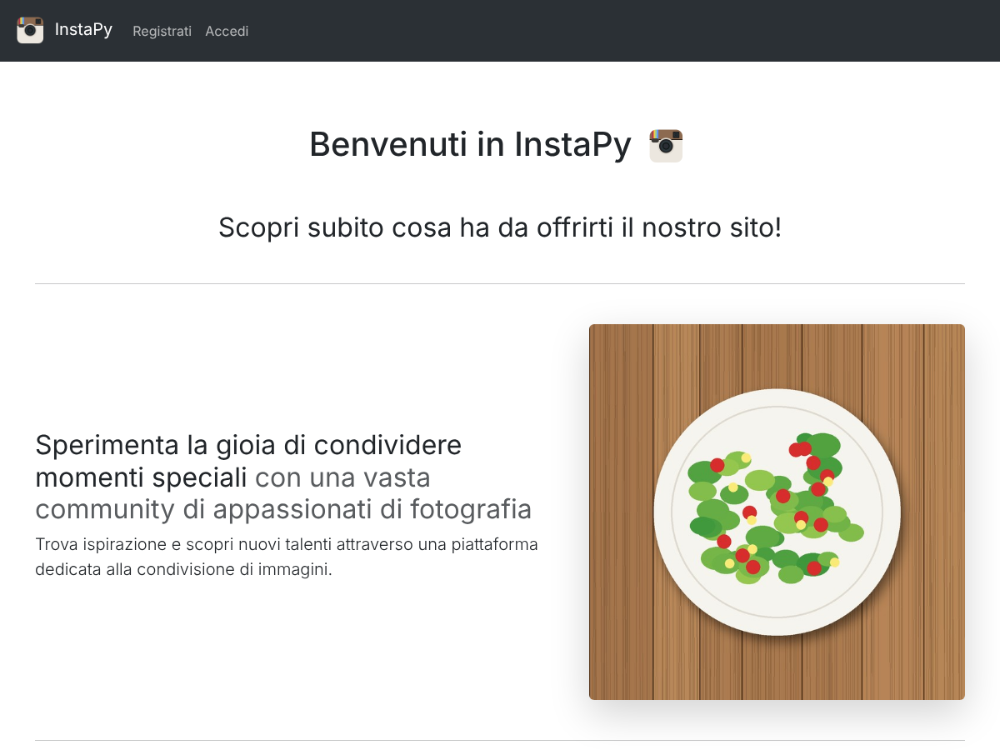
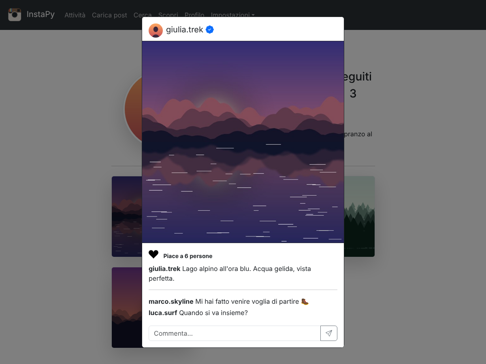
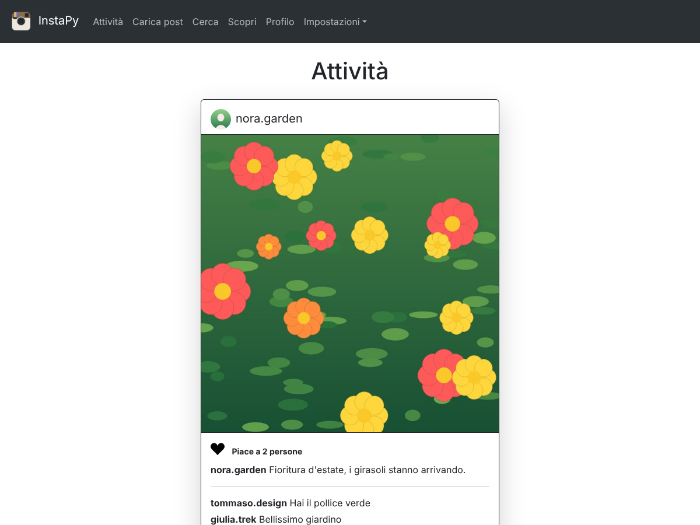
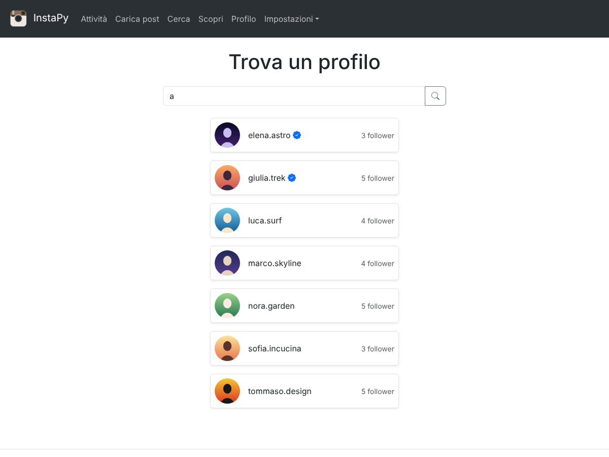
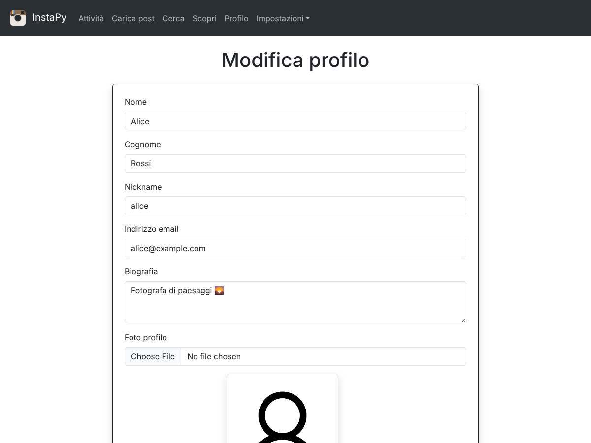

# InstaPy

Un piccolo social network per condividere foto, scritto in **Django**. Gli utenti si registrano, pubblicano foto (ritagliate in formato quadrato direttamente nel browser), mettono like, commentano e si seguono a vicenda.

Il progetto è nato in quinta superiore come primo approccio a Django ed è stato poi riscritto da zero seguendo le convenzioni del framework: custom user model, app separate, form e class-based views, test automatici e configurazione tramite variabili d'ambiente.

| Home | Profilo | Post |
|---|---|---|
|  |  |  |

| Attività (feed) | Ricerca | Impostazioni |
|---|---|---|
|  |  |  |

## Tecnologie

- **Backend:** Python 3.10+, Django 5.2 (LTS), SQLite
- **Immagini:** Pillow (validazione e gestione degli upload)
- **Frontend:** template Django, Bootstrap 5, Bootstrap Icons, JavaScript senza dipendenze (`fetch`) e [Cropper.js](https://github.com/fengyuanchen/cropperjs) per il ritaglio

## Funzionalità

- Registrazione, login e logout con il sistema di autenticazione di Django (validazione delle password inclusa)
- Profilo con foto, biografia, contatori di post/follower/seguiti e badge "verificato"
- Pubblicazione di post con ritaglio quadrato, modifica della descrizione, eliminazione
- Like e commenti senza ricaricare la pagina; l'autore del post può moderare i commenti
- Follow/unfollow, feed con i post di chi segui, pagina **Scopri** con i post degli altri, ricerca per nickname
- Modifica del profilo ed eliminazione dell'account (con conferma della password)
- Paginazione di feed, Scopri, profili e ricerca
- Pannello admin di Django configurato per tutti i modelli

## Come è fatto

### Modelli

| Modello | App | Descrizione |
|---|---|---|
| `User` | accounts | `AbstractUser` con bio, data di nascita, sesso, foto profilo, flag `verified`; il nickname è l'`username` (sempre minuscolo) |
| `Follow` | accounts | relazione follower → seguito, univoca e senza auto-follow |
| `Post` | posts | foto, descrizione, data, autore |
| `Like` | posts | un solo like per utente e post |
| `Comment` | posts | commento di un utente a un post |

### Pagine principali

| URL | Cosa fa |
|---|---|
| `/` | home page per i visitatori (se sei loggato vai al feed) |
| `/accounts/signup/`, `/accounts/login/` | registrazione e accesso |
| `/feed/` | post delle persone che segui |
| `/discover/` | ultimi post degli altri utenti |
| `/search/?q=...` | cerca un profilo |
| `/u/<nickname>/` | profilo e foto di un utente |
| `/posts/new/`, `/posts/manage/` | pubblica, modifica ed elimina i tuoi post |
| `/accounts/settings/` | modifica profilo ed elimina account |

Like, commenti e follow sono endpoint `POST` che rispondono in JSON (`/posts/<id>/like/`, `/posts/<id>/comments/`, `/u/<nickname>/follow/`) e vengono chiamati da `static/js/social.js`.

### Scelte tecniche

- **Autenticazione standard:** `AbstractUser`, `LoginRequiredMixin`, logout via POST, validatori di password di Django.
- **Permessi:** solo l'autore può modificare o cancellare un post; un commento può essere cancellato dal suo autore o dal proprietario del post.
- **Query efficienti:** like e commenti sono contati nel database (`annotate`, `Exists`) e i commenti sono caricati con `prefetch_related`; un test verifica che il numero di query non cresca con i post.
- **Sicurezza:** `SECRET_KEY` e host da variabili d'ambiente, protezione CSRF su tutte le richieste, controllo server-side di nickname/email univoci, immagini validate con Pillow e limite di 5 MB.

## Avvio rapido

Richiede Python 3.10+.

```bash
git clone <url-del-repository>
cd instapy

python -m venv .venv
source .venv/bin/activate        # Windows: .venv\Scripts\activate
pip install -r requirements.txt

cp .env.example .env             # Windows: copy .env.example .env
python manage.py migrate         # crea il database (obbligatorio la prima volta)
python manage.py seed_demo       # facoltativo: profili e foto di esempio
python manage.py runserver
```

Apri <http://127.0.0.1:8000>. Per un account amministratore: `python manage.py createsuperuser`.

### Dati demo

`seed_demo` crea 7 profili inventati (`giulia.trek`, `marco.skyline`, `sofia.incucina`, `luca.surf`, `elena.astro`, `tommaso.design`, `nora.garden`) con 3-4 foto ciascuno, commenti, like e follow. La password è `demo-pass-123` per tutti. Le foto sono illustrazioni generate al volo con Pillow, quindi non servono download. Con `python manage.py seed_demo --reset` si ricrea tutto da zero.

## Test

```bash
python manage.py test
```

I test coprono registrazione e login, permessi, like, commenti, follow, feed, numero costante di query e il comando `seed_demo`.

## Struttura del progetto

```
config/      impostazioni (base / dev / prod / test), URL principali, wsgi/asgi
accounts/    User personalizzato, Follow, autenticazione, profilo, ricerca
posts/       Post, Like, Comment, feed, Scopri, gestione dei post
core/        home page, form e validator condivisi, dati e comando seed_demo
templates/   base.html, template per app e partial riusabili
static/      css, js (social.js, cropper-upload.js) e immagini
docs/        screenshot usati in questo README
```

## Configurazione

Tutto ciò che è sensibile arriva dall'ambiente (vedi `.env.example`):

| Variabile | Significato |
|---|---|
| `DJANGO_SECRET_KEY` | obbligatoria in produzione |
| `DJANGO_DEBUG` | `True`/`False` (default `True` in sviluppo, `False` in produzione) |
| `DJANGO_ALLOWED_HOSTS` | host separati da virgola |

`manage.py` usa `config.settings.dev` (e `config.settings.test` per i test); `wsgi.py` e `asgi.py` usano `config.settings.prod`. In produzione servono anche un web server per `/static/` e `/media/` (`collectstatic` scrive in `staticfiles/`).

## Cosa è cambiato rispetto alla prima versione

- **Autenticazione:** modello utente basato su `AbstractUser` al posto di password e sessioni gestite a mano.
- **Sicurezza:** controllo di proprietà su modifica/eliminazione, validazione lato server, secret key fuori dal codice.
- **Struttura:** app separate, URL con `app_name`, una view per azione al posto di un unico POST con `type`, `ModelForm` e class-based views, `base.html` con ereditarietà.
- **Performance:** niente più query N+1 né `order_by("?")`, paginazione.
- **Frontend:** un solo `social.js`, un solo script di ritaglio, jQuery rimosso.
- **Repository:** `.gitignore`, `requirements.txt`, test, migrazioni ripartite da zero, dati demo generati al posto del database e delle foto personali.
